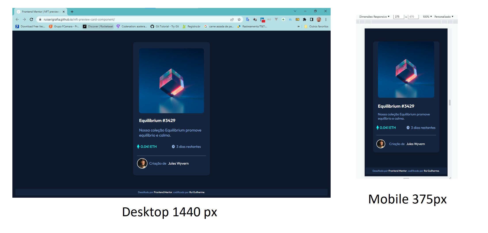

# Frontend Mentor - NFT componente do cartão de visualização

## Índice

- [Frontend Mentor - NFT componente do cartão de visualização](#frontend-mentor---nft-componente-do-cartão-de-visualização)
  - [Índice](#índice)
  - [Visão Geral](#visão-geral)
  - [Captura de tela](#captura-de-tela)
  - [Links](#links)
  - [Construído com](#construído-com)
  - [Autor](#autor)

## Visão Geral

Os usuários devem ser capazes de:
Veja o layout ideal dependendo do tamanho da tela do dispositivo

- Veja os estados de foco para elementos interativos

## Captura de tela

## Links

- URL da solução: [github.com/ruiserigrafia/nft-preview-card-component](https://github.com/ruiserigrafia/nft-preview-card-component)
- Url do site ao vivo: [ruiserigrafia.github.io/nft-preview-card-component/](https://ruiserigrafia.github.io/nft-preview-card-component/)

## Construído com

- Marcação HTML5 semântica
- Propriedades personalizadas CSS
- Flexbox
- Grade CSS

## Autor

- Linkedin [@ruiserigrafia](https://www.linkedin.com/in/ruiserigrafia/)
- github [@ruiserigrafia](https://github.com/ruiserigrafia/)
